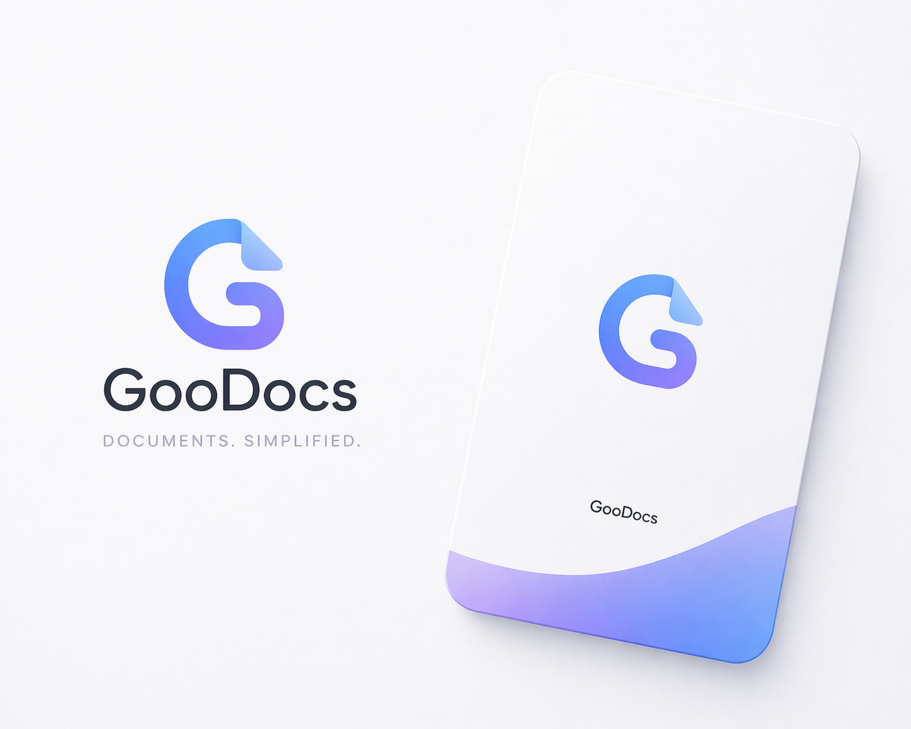

# GooDocs

| Logo | Description |
|---|---|
|  | **Beautiful Google Docs Templates** Premium, stylish, ready-to-copy layouts made with tables, typography, and clever formatting tricks. |

## Template Categories

        

---

## 🎨 What is GooDocs?
**GooDocs** is a curated, ever-growing collection of **Google Docs templates** — dark themes, light themes, newsletters, resumes, recipe cards, list styles, and more.

Every template is built by hand using:
- Advanced table-based layout techniques  
- Dramatic color palettes  
- Clean, structured formatting  
- Clever aesthetic elements you *cannot* get from default Google Docs styles  

Whether you want to design a recipe card, a professional newsletter, or a bold editorial-style document — GooDocs gives you beautiful starting points you can customize instantly.

## Template Previews

### Dark-Themed Templates

### Light-Themed Templates

## Resumes

1. [Dark Resume](https://docs.google.com/document/d/1Q8x9kErojUItoD8RU-jMzr3QUkVli0ouljI26wwiPHA/edit?usp=sharing)

## Newsletters

1. [Promotional Newsletter Template](https://docs.google.com/document/d/1Gye36AIIeei1iRn2c7IMd6oCdRPowTFue00y3xvwSfc/edit?usp=sharing)

2. [Fall Newsletter Template](https://docs.google.com/document/d/1oaWWcfOB2joLW9gpErQCdjICe4Zn-bAT6mNpfA8irZw/edit?usp=sharing)

3. [Skincare Newsletter](https://docs.google.com/document/d/1OCdDo3ZLrRmFlYxb4fFceEbFmZeSPTFy2NRco2WEETM/edit?usp=sharing)

4. [Email Newsletter](https://docs.google.com/document/d/174VaUnQu8Uzbyr0vBJEmaOTKGe004QIFVRpflPYwiQU/edit?usp=sharing)

5. [Abortion Rights Newsletter](https://docs.google.com/document/d/1HQWSOWj8KvYma-Dn66wSz96GEzl7E-b3DjuNUP3zziI/edit?usp=sharing) 

6. [Pixel Art Newsletter](https://docs.google.com/document/d/1weWu7oCKKOYbTGyHW7QKrk_RnRrzfQ9B2INcBW6vZes/edit?usp=sharing)

## Calendars

1. [Month Calendar](https://docs.google.com/document/d/1g4fJymEJLesAViN3fVGS22OckdyBUwIuWIz9CjYNM4k/edit?usp=sharing)

## Product Templates

1. [Product Onboarding Template](https://docs.google.com/document/d/1LGX5KCXPWnP8UtBM9FGrMgDvZ87Nz7Gc94vzZN2oXlI/edit?usp=sharing)

2. [Simple Product Onboarding Template](https://docs.google.com/document/d/1AXyBIPCgKVKBrSjVJajhw-mjvTWPuiISj2_9y_kWTXY/edit?usp=sharing)

3. [Github Product Template](https://docs.google.com/document/d/1f_ipqCGuW55aanDvEadpJqHaIueO9pmXQLenj_Jo_nU/edit?usp=sharing)

4. [Github Product Template \[BLANK\]](https://docs.google.com/document/d/1eKH3ULOi1yPFN5PerlE2qogpvi9ihjCTYPoLdDLsAsc/edit?usp=sharing)

## Worksheets

1. [Worksheet Template](https://docs.google.com/document/d/11Z8ciSjH7TjOwKWaVe08mPtsY3HsETagDZVfd05KCp4/edit?usp=sharing)

2. [Printable Quiz](https://docs.google.com/document/d/1HIDUSW1E6iIIsDwiHq1AzSN4qIMpP2MjIxiWJmvegeI/edit?usp=sharing)

3. [Relationship Worksheets](https://docs.google.com/document/d/1PbrV3pG6xjAwlmfHDAexJ4GjFzV5W10a-KN3sJP5g7E/edit?usp=sharing)

4. [Crossword Template](https://docs.google.com/document/d/1pycTG5wNwS5LxycYrM3Eidj8D5pfs-fl9ig64PzPlOU/edit?usp=sharing)

5. [Crossword Puzzle Template](https://docs.google.com/document/d/1JY15i8Yb-b3X63bWcWb-K2anmSxI2rxau0qiWtW-XTE/edit?usp=sharing)

6. [Crossword Practice](https://docs.google.com/document/d/1gM66566Oq3J6vgRXFm45SZxqe-m73IdedeUd-odzCeA/edit?usp=sharing)

7. [Crossword Answers](https://docs.google.com/document/d/1gg1rEUeTfnMMneGlbpaO0wMtjuFHCMjCupLgR-9P_8A/edit?usp=sharing)

8. [Worksheet Template](https://docs.google.com/document/d/1qoESqQgy9zvtcsGmi93GUMi5KER5N-_OlIpH2vsZrqc/edit?usp=sharing)

9. [Escorting Business Plan](https://docs.google.com/document/d/11Z8ciSjH7TjOwKWaVe08mPtsY3HsETagDZVfd05KCp4/edit?usp=sharing)

10. [Escorting Business Plan (Pink)](https://docs.google.com/document/d/19Sk57CqJmGH1BY1Watv35cTuiN7Kvc3Nr-6G99UhlG0/edit?usp=sharing)

11. [Complaint Form](https://docs.google.com/document/d/1EMJeRlpHEnb8OYQAq0pTgXkhBzXtb4HTWkSK7ExzH4g/edit?usp=sharing)

## Legal 

1. [License Agreement Template](https://docs.google.com/document/d/10uzLOEp-iCpNzvAKAse7VHfbtGka4MhWVJ7Zm5-ObBk/edit?usp=sharing)

## eBooks

1. [eBook Example](https://docs.google.com/document/d/1j4bv63nFqxcShKLLsZtsoiGPHGK8Tgx_e6YIOM4FxTw/edit?usp=sharing)

2. [Dark Fiction](https://docs.google.com/document/d/1xfskmbGYD7sgUZQDIUt45Z9S5OmmkkDZYXZdGhemPu0/edit?usp=sharing)

3. [Get Ex Back With Class](https://docs.google.com/document/d/1MEtPfBo_QLbdW--HyylbHbVAgqUdkt_niyc6hMMVzQQ/edit?usp=sharing)

4. [Recipe Templates](https://docs.google.com/document/d/1-QJBE_3Fx9ZfCWii2w1zFRMGOGbwK2dGmsSPvOuy8Gg/edit?usp=sharing)

5. [Tutorial Template](https://docs.google.com/document/d/1mIe1pAb_XcfCAlVVm4rmLq-9Wx8YExtlmBNzURUt6eA/edit?usp=sharing)

6. [Amazon Book Blurb Template](https://docs.google.com/document/d/1JCn6HHVJFLoLCc6H31ETtlsfI48JfS4dN3W-ImFRk7w/edit?usp=sharing)

7. [Blog Post Template](https://docs.google.com/document/d/1rJlFo_wztg32e200cpA6uFp8MW6zT9libBngG6LZFxE/edit?usp=sharing)

## Academic

1. [Quote Log Template](https://docs.google.com/document/d/1kHwhXZe5fGv1CpbEWYq1_1O7dABMmAo0/edit?usp=sharing&ouid=108103891676540118260&rtpof=true&sd=true)

2. [Academic Success Plan Template](https://docs.google.com/document/d/1FgeXD_CSvlnKrWWA2g3o6KDF-q7lRkq9PKCAl0rjnig/edit?usp=sharing)

3. [Group Project Evaluation Template](https://docs.google.com/document/d/14AN73PTLLtdTWtaKUcw-qhRVQH9g7p_H_NKbjamEHD4/edit?usp=sharing)

4. [PACE 111 Template](https://docs.google.com/document/d/1Ulb5Riy_rl6-QFYWrsf90VNgtAeFYS3CIl6QYoSAg3s/edit?usp=sharing)

5. [Job Market Comparison Template](https://docs.google.com/document/d/11NYDMxPyC3Qaccex7LzIvEte5G-n0J1wuzoxogCIDHo/edit?usp=sharing)

6. [Team Charter Template](https://docs.google.com/document/d/1hwF-GPM3adHOYHMuZaCRHFDJSwP5JyrZzS-QEPX76PA/edit?usp=sharing)

## Website Mockups

1. [Website Mockups](https://docs.google.com/document/d/1RxQ2CdWy_MxcNw4LLwpAS0Jt2ElPM78UAmhwAsN1Gko/edit?usp=sharing)

2. [Amazon A+ Content Modules](https://docs.google.com/document/d/18m171xJUuMxDlFuTSq93hcc9T-UhGWxWttBbmrK3Kl0/edit?usp=sharing)

3. [Online Shop](https://docs.google.com/document/d/1Tc8namk6C3OpOe112IKE6c9LN_6n6rCKso8Y35ScBvs/edit?usp=sharing)

## Email Templates

1. [Email Autoresponder Series](https://docs.google.com/document/d/1zTl0pms2AMhRRpHOG6DT5mZFY3qrhlIwkwOw3V8xMRw/edit?usp=sharing)

2. [Email Autoresponder Series \[BLANK\]](https://docs.google.com/document/d/1zTl0pms2AMhRRpHOG6DT5mZFY3qrhlIwkwOw3V8xMRw/edit?usp=sharing)

---

## ✨ Features
- Beautiful, modern Google Docs templates  
- Professional table-based layouts  
- Includes both **dark** and **light** themes  
- List styles, newsletters, recipe cards, resumes, and more  
- Drop-in-ready: just **File → Make a Copy**  
- Easy to customize: colors, fonts, borders, and images  
- Perfect for:
  - Writers  
  - Students  
  - Small businesses  
  - Creatives  
  - Substack creators  
  - Advocates & activists  

---

## ➕ Contribute a Template

GooDocs is a growing library of Google Docs templates—and contributions are welcome.

  

### Quick Start

1. Fork this repo
2. Add a preview image to `img/templates/`
3. Add your template to `templates/templates.json`
4. Open a pull request

## 🧪 Why GooDocs Exists
Because Google Docs is powerful — but visually plain.  

You’ve found a way to bypass its limitations with creative table formatting, layout tricks, borders, and style hacks that most people never discover.

GooDocs brings those hacks together into a public collection so anyone can create documents that look:
- professional  
- modern  
- polished  
- and *nothing like a default Google Doc*  

---

## ⭐ Credits
Created and maintained by **Ashly Lorenzana**  

---

